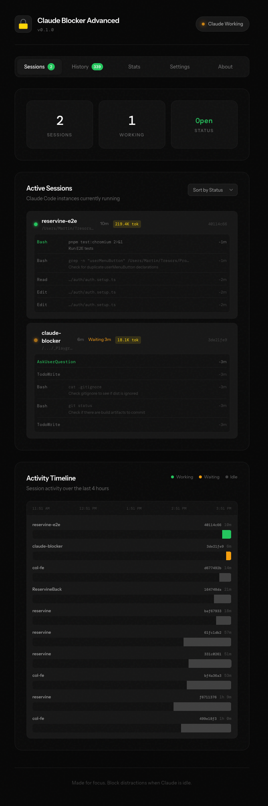
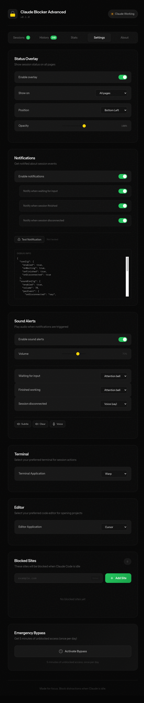
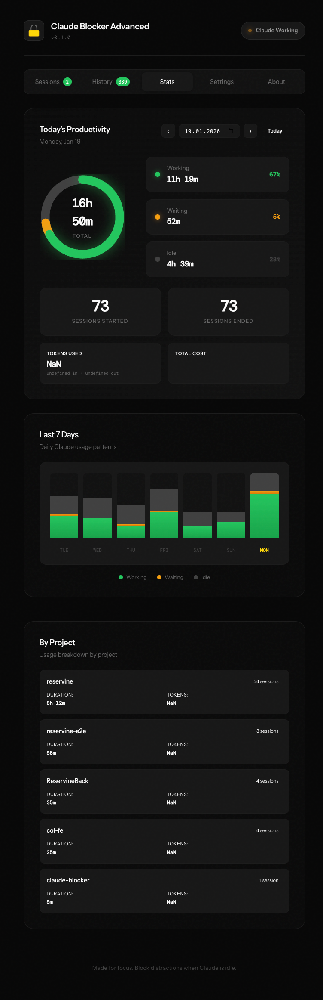

# Claude Blocker Advanced

> **Fork Notice**: This is a fork of [Theo's Claude Blocker](https://github.com/T3-Content/claude-blocker) with advanced features and improvements.

Block distracting websites unless [Claude Code](https://claude.ai/claude-code) is actively running inference.

**The premise is simple:** if Claude is working, you should be too. When Claude stops, your distractions come back.

## Screenshots

<details>
<summary><strong>📊 Dashboard View</strong> - Session monitoring with rich detail cards</summary>


</details>

<details>
<summary><strong>⚙️ Settings & Configuration</strong> - Blocked domains, overlay, and notification settings</summary>


</details>

<details>
<summary><strong>📈 Productivity Stats</strong> - Track usage, costs, and productivity by project</summary>


</details>

## How It Works

```
┌─────────────────┐     hooks      ┌─────────────────┐    websocket    ┌─────────────────┐
│   Claude Code   │ ─────────────► │  Blocker Server │ ◄─────────────► │ Chrome Extension│
│   (terminal)    │                │  (localhost)    │                 │   (browser)     │
└─────────────────┘                └─────────────────┘                 └─────────────────┘
       │                                   │                                   │
       │ UserPromptSubmit                  │ tracks sessions                   │ blocks sites
       │ PreToolUse                        │ broadcasts state                  │ shows modal
       │ Stop                              │                                   │ bypass button
       └───────────────────────────────────┴───────────────────────────────────┘
```

1. **Claude Code hooks** notify the server when you submit a prompt or when Claude finishes
2. **Blocker server** tracks all Claude Code sessions and their working/idle states
3. **Chrome extension** blocks configured sites when no session is actively working

## Quick Start

### 1. Install the server

```bash
npx claude-blocker-advanced --setup
```

This installs the Claude Code hooks and starts the server. The hooks are configured in `~/.claude/settings.json`.

### 2. Install the Chrome extension

- Download from [Chrome Web Store](#) *(coming soon)*
- Or load unpacked from `packages/extension/dist`

### 3. Configure blocked sites

Click the extension icon → Settings to add sites you want blocked when Claude is idle.

Default blocked sites: `x.com`, `youtube.com`

## Server CLI

```bash
# Start with auto-setup (recommended for first run)
npx claude-blocker-advanced --setup

# Start on custom port
npx claude-blocker-advanced --port 9000

# Remove hooks from Claude Code settings
npx claude-blocker-advanced --remove

# Show help
npx claude-blocker-advanced --help
```

## Features

- **Soft blocking** — Sites show a modal overlay, not a hard block
- **Real-time updates** — No page refresh needed when state changes
- **Multi-session support** — Tracks multiple Claude Code instances
- **Emergency bypass** — 5-minute bypass, once per day
- **Configurable sites** — Add/remove sites from extension settings
- **Works offline** — Blocks everything when server isn't running (safety default)
- **Session monitoring dashboard** — Rich session info with timeline view
- **Desktop notifications** — Get notified when Claude needs input
- **Sound alerts** — Configurable audio notifications
- **Quick actions** — Open project in terminal, editor, or Finder

## Requirements

- Node.js 18+
- Chrome (or Chromium-based browser)
- [Claude Code](https://claude.ai/claude-code)

## Development

```bash
# Clone and install
git clone https://github.com/genesiscz/claude-blocker-advanced.git
cd claude-blocker-advanced
pnpm install

# Build everything
pnpm build

# Development mode
pnpm dev
```

### Project Structure

```
packages/
├── server/      # Node.js server + CLI (published to npm as claude-blocker-advanced)
├── extension/   # Chrome extension (Manifest V3)
└── shared/      # Shared TypeScript types
```

## Privacy

- **No data collection** — All data stays on your machine
- **Local only** — Server runs on localhost, no external connections
- **Chrome sync** — Blocked sites list syncs via your Chrome account (if enabled)

See [PRIVACY.md](PRIVACY.md) for full privacy policy.

## Credits

This project is a fork of [claude-blocker](https://github.com/T3-Content/claude-blocker) by [Theo Browne](https://github.com/t3dotgg).

## License

MIT
